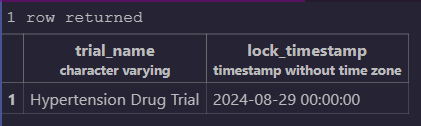

# clinical_database_locks

-> Implementation of database locks with multiple sessions

-> Understanding and analysing database locks

1. Retrieving and analyzing locked trials and their impact on trial outcomes.
2. Implementing mechanisms to prevent updates to locked trials, preserving data integrity during critical stages.
3. Monitoring the duration and frequency of locks, providing insights into trial progress and completion rates.

